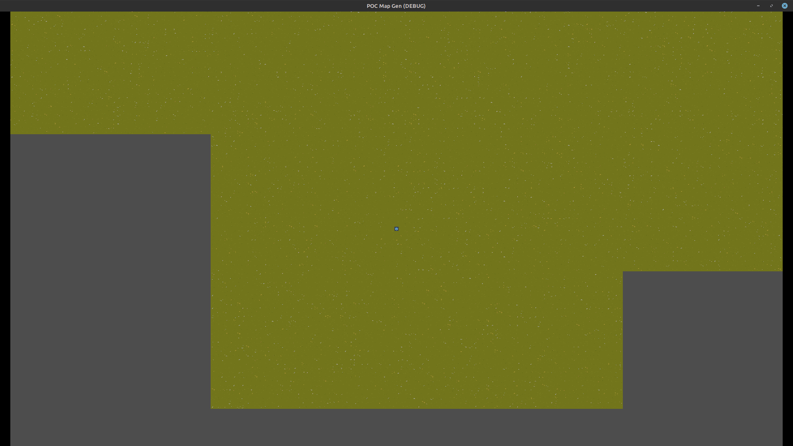

# POC Map Gen [Game](https://deniszholob.itch.io/godot-poc-map-gen)

Proof of concept for chunk based map generation in Godot.  
Similar to Minecraft or Factorio.

> **Play it on [Itch.io](https://deniszholob.itch.io/godot-poc-map-gen)!**

## Deployments 

- See [Contributing](./CONTRIBUTING.md) for technical details.
- See [Assets Readme](./assets/README.md) for asset details.

# Support Me

If you find the cheat sheet or the source code useful, consider:

- Donating Ko-fi: https://ko-fi.com/deniszholob
- Supporting on Patreon: https://www.patreon.com/deniszholob

# Screenshots

